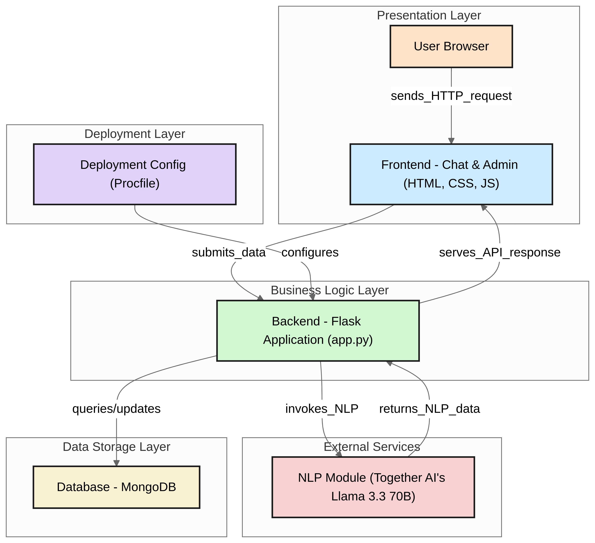
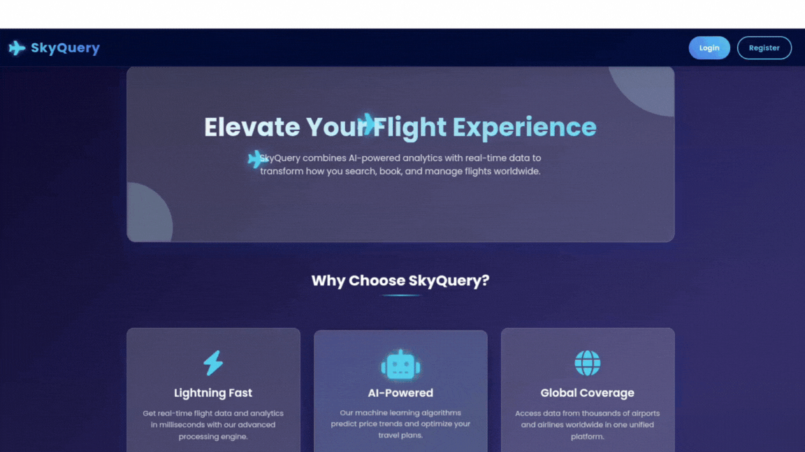

# SkyQuery - Your AI-Powered Flight Information Assistant

SkyQuery is an interactive flight information chatbot that provides real-time flight status updates, departure times, and flight details. The application uses a Flask backend with MongoDB for data storage and the Llama 3.3 70B model for natural language processing.

## 🌐 Live Demo

Try SkyQuery now: [https://skyquery-agentic-database-reader.onrender.com/](https://skyquery-agentic-database-reader.onrender.com/)

## 🚀 Features

- **Flight Status Lookup**: Quickly check the status of any flight by providing the flight number
- **Destination-Based Search**: Find all flights going to a specific destination
- **Route-Based Search**: Find all flights from a specific origin to a destination
- **Natural Language Interface**: Ask questions in everyday language rather than using specific commands
- **Real-Time Data**: Connect to an up-to-date flight database for accurate information
- **Responsive Design**: Works seamlessly on both desktop and mobile devices
- **Admin Dashboard**: Secure administrative interface for managing flight data
- **User Authentication**: Secure login system with role-based access control
- **User Registration**: New users can create accounts with personalized preferences
- **User Preferences**: Save favorite destinations and preferred airlines
- **Flight Management**: Add, edit, and delete flight information through the admin interface
- **API Endpoints**: RESTful API for programmatic access to flight data
- **Conversational AI**: Enhanced chatbot responses with greeting detection and help functionality
- **Conversation Memory**: The chatbot remembers context from previous exchanges
- **Entity Tracking**: System tracks flight numbers, origins, and destinations for follow-up questions
- **Secure Password Storage**: User passwords are securely hashed using bcrypt
- **Today's Flights View**: Quick access to all flights departing today
- **Conversation Reset**: Users can clear their conversation history

## Architecture


## Screenshot of SkyQuery
 ### Homepage


 ### Admin Dashboard
 


## Chatbot


## 📋 Prerequisites

- Python 3.8 or higher
- MongoDB Atlas account
- Together AI API key
- Miniconda or Anaconda (for virtual environment)
- Git (optional, for cloning the repository)

## 🔧 Installation & Setup

### Setting Up a Virtual Environment with Miniconda

1. **Install Miniconda**:
   - Download and install Miniconda from [https://docs.conda.io/en/latest/miniconda.html](https://docs.conda.io/en/latest/miniconda.html)
   - Follow the installation instructions for your operating system

2. **Create a new Conda environment**:
   ```bash
   conda create -n skyquery python=3.9
   ```

3. **Activate the environment**:
   ```bash
   # On Windows
   conda activate skyquery
   
   # On macOS/Linux
   source activate skyquery
   ```

### Project Setup

1. **Clone the repository**:
   ```bash
   git clone https://github.com/Surya-KF/SkyQuery-Agentic-DataBase-Reader.git
   cd SkyQuery-Agentic-DataBase-Reader
   ```

2. **Install required dependencies**:
   ```bash
   pip install -r requirements.txt
   ```

3. **Create a `.env` file** in the project root directory with the following variables:
   ```
   TOGETHER_API_KEY=your_together_api_key
   MONGO_PASSWORD=your_mongodb_password
   SECRET_KEY=your_secret_key_for_sessions
   ```

4. **Setup MongoDB**:
   - Create a MongoDB Atlas cluster
   - Create a database named "Flights"
   - Create collections named "flights" and "users"
   - Add flight data to the collection with the following structure:
     ```json
     {
       "flight_number": "AI123",
       "airline": "Air India",
       "departure_time": "10:30 AM",
       "departure_date": "2025-03-30",
       "origin": "Delhi",
       "destination": "Dubai",
       "status": "On Time"
     }
     ```

## 🏃‍♂️ Running the Application

### Local Development

```bash
python app.py
```
The application will be available at `http://localhost:5000`

### Deployment on Render

The application is currently deployed on Render. To deploy your own instance:

1. Create a new Web Service on Render
2. Connect your GitHub repository
3. Configure the build command: `pip install -r requirements.txt`
4. Configure the start command: `gunicorn app:app`
5. Add your environment variables in the Render dashboard
6. Deploy the application

## 🧠 How It Works

### Architecture

SkyQuery uses a multi-agent architecture:

1. **Chat Interface**: HTML/CSS/JavaScript frontend for user interaction
2. **Natural Language Processing**: Together AI's Llama 3.3 70B model extracts flight numbers and destinations
3. **Information Retrieval**: MongoDB database queries for flight information
4. **Response Generation**: Structured response formatting for consistent user experience
5. **Admin System**: Secure backend for flight data management
6. **Authentication**: User login and session management
7. **Conversation Memory**: Tracking context for follow-up questions

### Query Processing Flow

1. User enters a query (e.g., "When does flight AI123 depart?")
2. The app extracts the flight number or destination using NLP
3. It queries the MongoDB database for relevant flight information
4. Results are formatted and presented to the user with appropriate visualization
5. The system remembers entities (flight numbers, destinations) for context in follow-up questions

### Admin Workflow

1. Admin logs in with secure credentials
2. Admin dashboard displays all flights in the system
3. Admin can add new flights, edit existing flight details, or delete flights
4. Changes are immediately reflected in the database and available to users

## 📦 Project Structure

```
skyquery/
├── .env                  # Environment variables (not in version control)
├── .gitignore            # Git ignore file
├── Procfile              # Deployment configuration
├── README.md             # Project documentation
├── app.py                # Main Flask application
├── requirements.txt      # Python dependencies
├── static/
│   ├── css/
│   │   └── style.css     # Application styling
│   └── js/
│       └── script.js     # Frontend JavaScript
└── templates/
    ├── index.html        # Main HTML template
    ├── login.html        # User login page
    ├── register.html     # User registration page
    ├── chatbot.html      # Chatbot interface
    ├── dashboard.html    # User dashboard
    ├── admin.html        # Admin dashboard
    ├── add_flight.html   # Form for adding flights
    ├── edit_flight.html  # Form for editing flights
    └── about.html        # About page
```

## 🔍 API Endpoints

The application provides the following API endpoints:

- `GET /`: Main application interface
- `GET /chatbot`: Chatbot interface (requires login)
- `GET /register`: User registration page
- `POST /register`: Process registration requests
- `GET /login`: User login page
- `POST /login`: Process login requests
- `GET /logout`: Log out the current user
- `GET /dashboard`: User dashboard showing today's flights
- `GET /admin`: Admin dashboard (requires admin role)
- `GET /admin/flights/add`: Form to add new flights
- `POST /admin/flights/add`: Process new flight submissions
- `GET /admin/flights/edit/<flight_number>`: Form to edit a specific flight
- `POST /admin/flights/edit/<flight_number>`: Process flight edit submissions
- `POST /admin/flights/delete/<flight_number>`: Delete a specific flight
- `POST /api/chat`: Process user queries and return flight information
- `GET /api/flights`: Retrieve all flights from the database
- `GET /api/preferences`: Get user preferences
- `POST /api/preferences`: Update user preferences
- `POST /api/conversation/clear`: Clear conversation history
- `GET /about`: About page with information about the application

## 🎯 Example Queries

Users can ask questions like:

- "When does Flight AI123 depart?"
- "What is the status of Flight EK500?"
- "Tell me about Flight LH789"
- "Show me flights to London"
- "Are there any flights from New York to Paris?"
- "What flights are going to Dubai today?"
- Follow-up questions like "When does it arrive?" or "What's the status?"
- "Help" - For instructions on how to use the chatbot
- "Hello" - For a friendly greeting response

## 👤 User Roles

### Regular Users
- Can register for a new account
- Can query flight information through the chatbot interface
- Can view flight details based on flight number or destination
- Can view all flights departing today on the dashboard
- Can set and update preferences (favorite destinations, preferred airlines)
- Can clear conversation history

### Admin Users
- Default admin credentials are created on first run:
  - Username: Admin
  - Password: **************
- Can access the admin dashboard
- Can add, edit, and delete flight information
- Can view all flights in the system

## 🛠️ Customization

### Adding More Flight Data

To add more flight data, you can:

1. Use the admin interface to add flights through the web UI
2. Insert additional documents into your MongoDB "flights" collection:

```javascript
db.flights.insertMany([
  {
    "flight_number": "LH789",
    "airline": "Lufthansa",
    "departure_time": "02:15 PM",
    "departure_date": "2025-03-30",
    "origin": "Mumbai",
    "destination": "Frankfurt",
    "status": "Boarding"
  },
  // Add more flight objects here
]);
```

### User Preferences

Users can customize their experience with preferences:
- Favorite destinations for quick access
- Preferred airlines for filtering results
- Display format preferences (detailed or concise)

These preferences are stored in the user's profile and can be updated through the API.

### Changing the UI

The UI is built with HTML, CSS, and JavaScript. You can customize:

- Colors and styling in `static/css/style.css`
- UI elements in `templates/index.html`
- Interaction behavior in `static/js/script.js`
- Admin interface in the admin template files

## 🔑 Getting API Keys

### Together AI API Key
1. Sign up for an account at [Together AI](https://www.together.ai/)
2. Navigate to your account settings or API section
3. Generate a new API key and copy it to your `.env` file

## ⚠️ Common Issues and Troubleshooting

- **MongoDB Connection Problems**: Ensure your MongoDB Atlas whitelist includes your IP address
- **API Rate Limiting**: Be aware of Together AI's rate limits for the free tier
- **Environment Variables**: Double check that your `.env` file is in the correct location and properly formatted
- **Admin Access Issues**: If you can't access the admin dashboard, ensure your user has the 'admin' role in the database
- **Flight Data Not Appearing**: Check that your flight documents have the correct structure in MongoDB
- **Session Errors**: Make sure you've set a secure SECRET_KEY in your .env file
- **Registration Issues**: Ensure usernames and emails are unique in the database
- **Follow-up Questions Not Working**: Check that conversation history is being properly maintained

## 🌍 Real-World Use Cases

SkyQuery can be deployed in various real-world scenarios to improve flight information access:

### 1. Airport Information Kiosks
- Deploy on touchscreen kiosks throughout airports
- Allow travelers to quickly check flight statuses without waiting in line
- Reduce congestion at information desks during peak travel times

### 2. Customer Service Augmentation
- Handle routine flight status inquiries, freeing human agents for complex issues
- Reduce call center wait times during high-volume periods
- Provide 24/7 flight information access when human agents are unavailable

### 3. Travel Agency Support Tool
- Enable travel agents to quickly check flight information for clients
- Improve service efficiency and reduce time spent on routine information lookups
- Integrate with booking systems for seamless information flow

### 4. Corporate Travel Management
- Allow employees to check flight statuses without contacting the travel department
- Send automated notifications about flight changes to relevant team members
- Streamline travel expense reporting with accurate flight data

### 5. Mobile Travel Companion
- Send push notifications about gate changes, delays, or cancellations
- Provide voice-activated flight information for hands-free use
- Integrate with calendar apps to automatically track upcoming flights

### 6. Airport Operations Management
- Monitor all flights at a facility in real-time
- Allocate resources based on flight statuses and passenger loads
- Coordinate gate assignments and ground services

### 7. Accessibility Solution
- Make flight information more accessible to visually impaired travelers through voice interaction
- Help elderly travelers who may struggle with complex web interfaces
- Assist international travelers with language barriers (with multilingual support)

### 8. Emergency Response Tool
- Scale to handle surge in status inquiries during travel disruptions
- Provide consistent, accurate information to all passengers
- Free human agents to handle complex rebooking and accommodation needs

## 🔒 Security Features

- **Password Hashing**: All user passwords are securely hashed using bcrypt
- **Session Management**: Secure session handling with Flask
- **Role-Based Access Control**: Different permissions for regular users and admins
- **Protected Routes**: Authentication required for sensitive operations
- **Input Validation**: Validation of user inputs to prevent injection attacks

---
## 📝 License

This project is licensed under the MIT License - see the LICENSE file for details.

## 👥 Contributing

Contributions are welcome! Please feel free to submit a Pull Request.

## 📞 Support

If you have any questions or need assistance with the application, please open an issue in the repository.

Created with ❤️ by [Surya-KF](https://github.com/Surya-KF)
