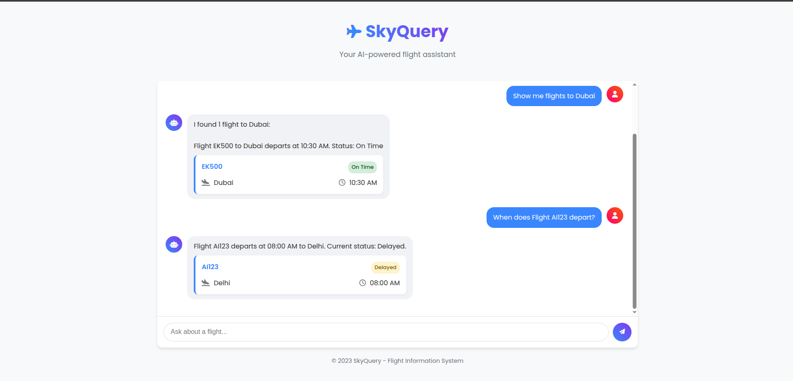

# SkyQuery - Your AI-Powered Flight Information Assistant

SkyQuery is an interactive flight information chatbot that provides real-time flight status updates, departure times, and flight details. The application uses a Flask backend with MongoDB for data storage and the Llama 3.3 70B model for natural language processing.


## 🚀 Features

- **Flight Status Lookup**: Quickly check the status of any flight by providing the flight number
- **Destination-Based Search**: Find all flights going to a specific destination
- **Natural Language Interface**: Ask questions in everyday language rather than using specific commands
- **Real-Time Data**: Connect to an up-to-date flight database for accurate information
- **Responsive Design**: Works seamlessly on both desktop and mobile devices

## Screenshot of SkyQuery





## 📋 Prerequisites

- Python 3.8 or higher
- MongoDB Atlas account
- Together AI API key
- Miniconda or Anaconda (for virtual environment)
- Git (optional, for cloning the repository)

## 🔧 Installation & Setup

### Setting Up a Virtual Environment with Miniconda

1. **Install Miniconda**:
   - Download and install Miniconda from [https://docs.conda.io/en/latest/miniconda.html](https://docs.conda.io/en/latest/miniconda.html)
   - Follow the installation instructions for your operating system

2. **Create a new Conda environment**:
   ```bash
   conda create -n skyquery python=3.9
   ```

3. **Activate the environment**:
   ```bash
   # On Windows
   conda activate skyquery
   
   # On macOS/Linux
   source activate skyquery
   ```

### Project Setup

1. **Clone the repository**:
   ```bash
   git clone https://github.com/Surya-KF/SkyQuery-Agentic-DataBase-Reader.git
   cd SkyQuery-Agentic-DataBase-Reader
   ```

2. **Install required dependencies**:
   ```bash
   pip install -r requirements.txt
   ```

3. **Create a `.env` file** in the project root directory with the following variables:
   ```
   TOGETHER_API_KEY=your_together_api_key
   MONGO_PASSWORD=your_mongodb_password
   ```

4. **Setup MongoDB**:
   - Create a MongoDB Atlas cluster
   - Create a database named "Flights"
   - Create a collection named "flights"
   - Add flight data to the collection with the following structure:
     ```json
     {
       "flight_number": "AI123",
       "departure_time": "10:30 AM",
       "departure_date": "2025-03-30",
       "destination": "Dubai",
       "status": "On Time"
     }
     ```

## 🏃‍♂️ Running the Application

### Local Development

```bash
python app.py
```
The application will be available at `http://localhost:5000`

### Deployment on Heroku

This application is configured for Heroku deployment:

1. Create a new Heroku app:
   ```bash
   heroku create your-app-name
   ```

2. Add your environment variables to Heroku:
   ```bash
   heroku config:set TOGETHER_API_KEY=your_together_api_key
   heroku config:set MONGO_PASSWORD=your_mongodb_password
   ```

3. Deploy to Heroku:
   ```bash
   git push heroku main
   ```

## 🧠 How It Works

### Architecture

SkyQuery uses a multi-agent architecture:

1. **Chat Interface**: HTML/CSS/JavaScript frontend for user interaction
2. **Natural Language Processing**: Together AI's Llama 3.3 70B model extracts flight numbers and destinations
3. **Information Retrieval**: MongoDB database queries for flight information
4. **Response Generation**: Structured response formatting for consistent user experience

### Query Processing Flow

1. User enters a query (e.g., "When does flight AI123 depart?")
2. The app extracts the flight number or destination using NLP
3. It queries the MongoDB database for relevant flight information
4. Results are formatted and presented to the user with appropriate visualization

## 📦 Project Structure

```
skyquery/
├── .env                  # Environment variables (not in version control)
├── .gitignore            # Git ignore file
├── Procfile              # Heroku deployment configuration
├── README.md             # Project documentation
├── app.py                # Main Flask application
├── requirements.txt      # Python dependencies
├── static/
│   ├── css/
│   │   └── style.css     # Application styling
│   └── js/
│       └── script.js     # Frontend JavaScript
└── templates/
    └── index.html        # Main HTML template
```

## 🔍 API Endpoints

The application provides the following API endpoints:

- `GET /`: Main application interface
- `POST /api/chat`: Process user queries and return flight information
- `GET /api/flights`: Retrieve all flights from the database

## 🎯 Example Queries

Users can ask questions like:

- "When does Flight AI123 depart?"
- "What is the status of Flight EK500?"
- "Tell me about Flight LH789"
- "Show me flights to London"
- "Are there any flights to Dubai today?"

## 🛠️ Customization

### Adding More Flight Data

To add more flight data, insert additional documents into your MongoDB "flights" collection:

```javascript
db.flights.insertMany([
  {
    "flight_number": "LH789",
    "departure_time": "02:15 PM",
    "departure_date": "2025-03-30",
    "destination": "Frankfurt",
    "status": "Boarding"
  },
  // Add more flight objects here
]);
```

### Changing the UI

The UI is built with HTML, CSS, and JavaScript. You can customize:

- Colors and styling in `static/css/style.css`
- UI elements in `templates/index.html`
- Interaction behavior in `static/js/script.js`

## 🔑 Getting API Keys

### Together AI API Key
1. Sign up for an account at [Together AI](https://www.together.ai/)
2. Navigate to your account settings or API section
3. Generate a new API key and copy it to your `.env` file

## ⚠️ Common Issues and Troubleshooting

- **MongoDB Connection Problems**: Ensure your MongoDB Atlas whitelist includes your IP address
- **API Rate Limiting**: Be aware of Together AI's rate limits for the free tier
- **Environment Variables**: Double check that your `.env` file is in the correct location and properly formatted

## 📝 License

This project is licensed under the MIT License - see the LICENSE file for details.

## 👥 Contributing

Contributions are welcome! Please feel free to submit a Pull Request.

## 📞 Support

If you have any questions or need assistance with the application, please open an issue in the repository.

---

Created with ❤️ by [Surya-KF](https://github.com/Surya-KF)